# Agentic Knowledge Units Architecture Plan

This document is the visual implementation companion to [DS008 - Agentic Knowledge Units](specs/DS008-AgenticKnowledgeUnits.md). The DS file is the governing contract. This document explains the architecture, flow boundaries, and implementation sequence with Mermaid diagrams.

## Architectural Position

AKU is an additive AchillesAgentLib utility library. It is not part of `MainAgent` session execution, not a skill subsystem, and not an LLM feature. Skills and host applications call AKU explicitly when they want local project memory.

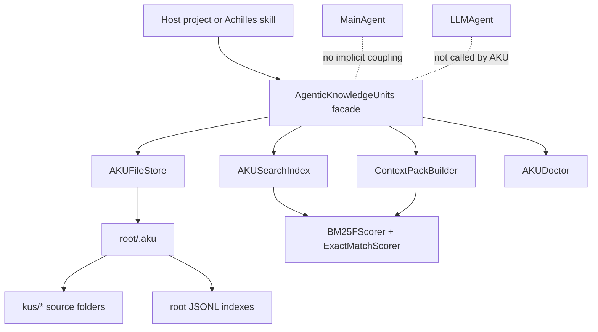

The boundary is deliberate: AchillesAgentLib already contains the agent runtime, LLM layer, skill subsystems, and supporting utilities. AKU should provide local durable memory that those layers may use, without creating hidden persistence or hidden inference.

## Module Layout

The first implementation should use one compact public entry point, a public facade class, type declarations, and private internal modules for storage, ranking, indexing, context packing, and recovery.

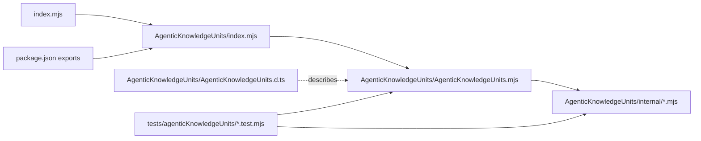

The entry point is the stable API. Internal files are allowed and preferred where they make responsibilities clearer, but callers must not import them directly.

The initial internal layout is:

```txt
AgenticKnowledgeUnits/
  index.mjs
  AgenticKnowledgeUnits.mjs
  AgenticKnowledgeUnits.d.ts
  internal/
    constants.mjs
    errors.mjs
    schemas.mjs
    paths.mjs
    storage.mjs
    locking.mjs
    atomic-write.mjs
    indexing.mjs
    tokenizer.mjs
    ranking.mjs
    context-pack.mjs
    doctor.mjs
```

## Storage Layout

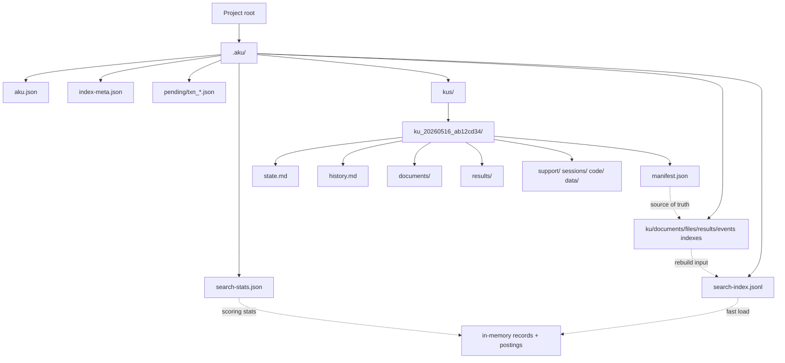

The aggregate files are search caches. The KU folders remain the durable source of truth.

## Runtime Lifecycle

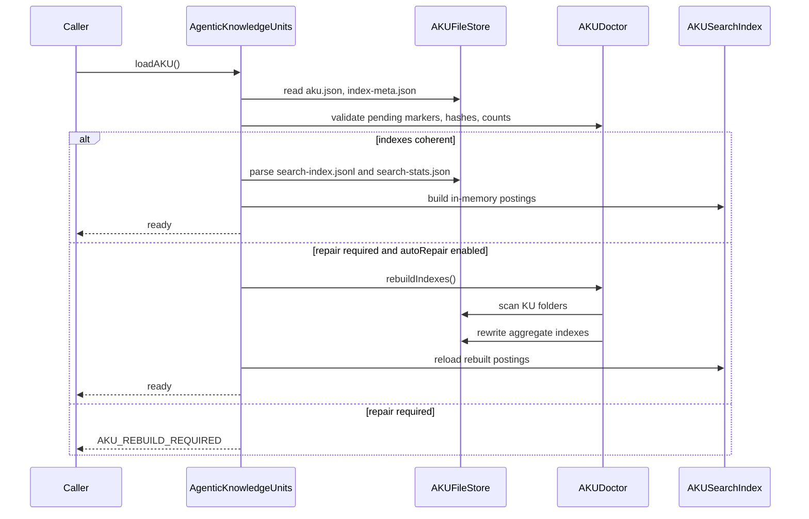

## Write Transaction Flow

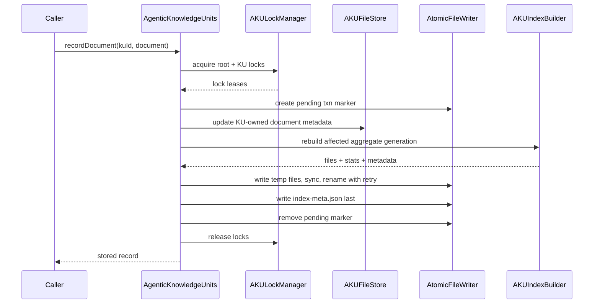

`index-meta.json` is the commit marker for a coherent aggregate-index generation. A pending marker or metadata mismatch at startup triggers doctor behavior.

## Search Pipeline

```mermaid
flowchart LR
    Query["query object"] --> Normalize["normalize text, tags, keywords, phrases"]
    Normalize --> Compile["compile filters"]
    Compile --> Candidates["candidate generation from postings"]
    Candidates --> HardFilters["apply hard filters"]
    HardFilters --> BM25F["classic BM25F lexical score"]
    BM25F --> Exact["bounded exact-match channel"]
    Exact --> Meta["status + weak recency modifiers"]
    Meta --> Diversity["maxResultsPerKU diversity"]
    Diversity --> Explain["matched_on + score_components"]
    Explain --> Results["search results"]
```

BM25F must combine field evidence per term before saturation. Exact matches are bounded side-channel signals, not uncapped additive score piles.

## ContextPack Flow

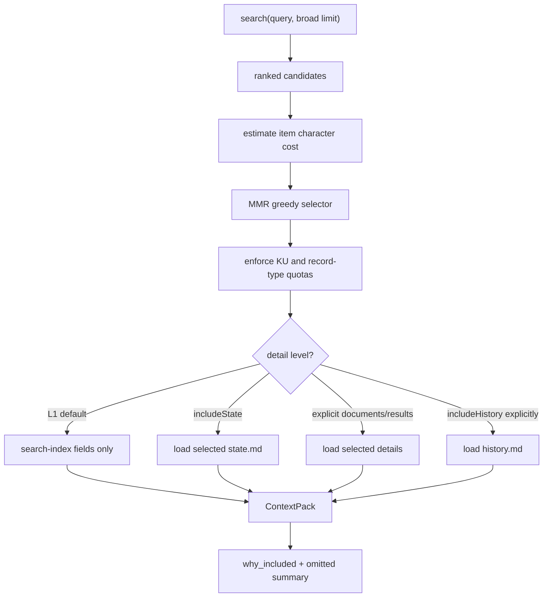

Redundancy is lexical and deterministic: same KU, title overlap, tag or keyword overlap, token Jaccard overlap, path ancestry, and repeated record type.

## Class Diagram

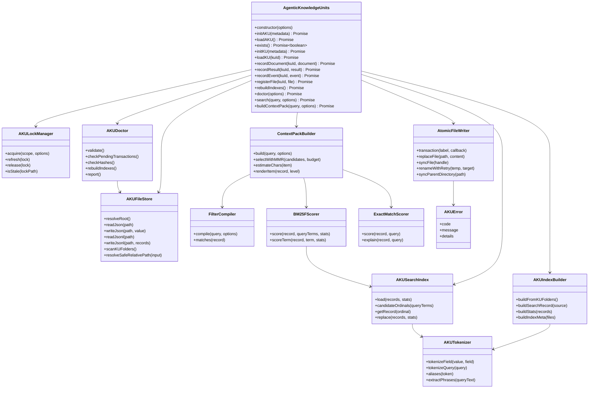

The facade owns orchestration. The collaborators remain small and interchangeable. This preserves a compact public API without collapsing all responsibilities into one class or one large implementation file.

## Design Decisions

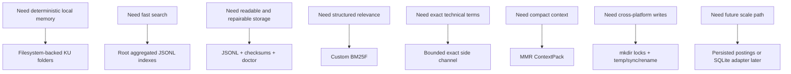

## V1 Guardrails

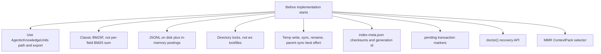

## Implementation Milestones

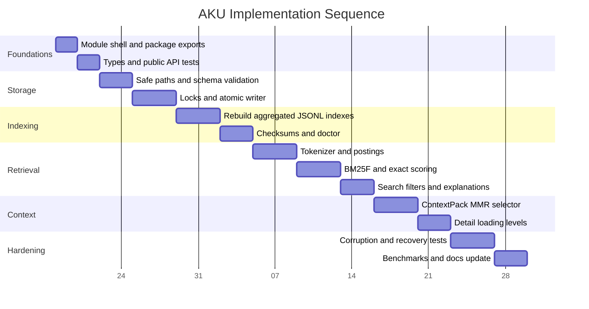

The dates are sequencing anchors, not release commitments. The important constraint is dependency order: storage safety and rebuildability must land before ranking features depend on generated indexes.

## SOLID And DRY Mapping

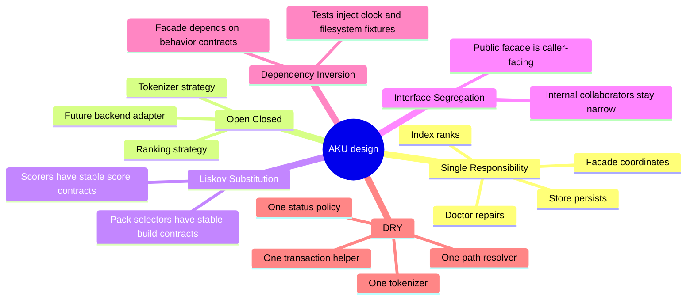

The implementation should avoid broad abstract base classes. In JavaScript, small composable objects with explicit method contracts are enough.

## Test Architecture

```mermaid
flowchart TB
    StorageTest["storage.test.mjs"] --> Atomic["atomic writes + JSONL"]
    StorageTest --> Paths["safe paths + dirs"]

    SearchTest["search.test.mjs"] --> Tokenizer["tokenizer aliases"]
    SearchTest --> Ranking["classic BM25F + exact caps"]
    SearchTest --> Filters["filters + status + recency"]

    IndexTest["indexing.test.mjs"] --> Rebuild["full rebuilds"]
    IndexTest --> Stats["stats + checksums + postings"]

    ContextTest["contextPack.test.mjs"] --> MMR["ContextPack MMR"]
    ContextTest --> Budget["char budget + quotas"]

    LifecycleTest["agenticKnowledgeUnits.test.mjs"] --> Lifecycle["public API lifecycle"]
    RecoveryTest["recovery.test.mjs"] --> Pending["pending transaction marker"]
    RecoveryTest --> Corrupt["corrupt JSONL/hash mismatch"]
    RecoveryTest --> Locks["stale lock cleanup"]
    SecurityTest["security.test.mjs"] --> Traversal["traversal + symlink rejection"]
    ExportTest["packageExports.test.mjs"] --> Package["root + subpath exports"]

    Bench["Benchmarks"] --> Load["cold load"]
    Bench --> Search["warm search"]
    Bench --> Pack["ContextPack"]
    Bench --> RebuildCost["rebuild cost"]
```

Filesystem tests should use temporary directories and should not write into repository `.aku` folders. Warm-process acceptance targets are: `search()` under 25 ms for typical 1,000-record filtered queries, under 200 ms for typical 10,000-record filtered queries, and L1 `buildContextPack()` under 100 ms after candidates are available.

## Migration Path

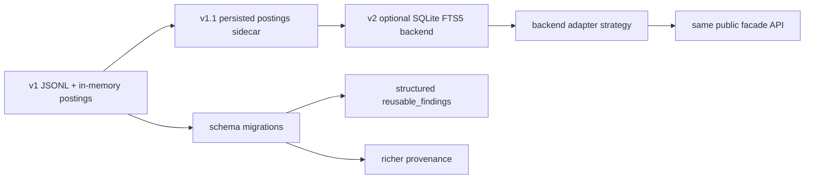

The migration rule is that KU folders and denormalized search records remain the source for rebuilding any optimized backend. Future backends must not become the only copy of user memory.
